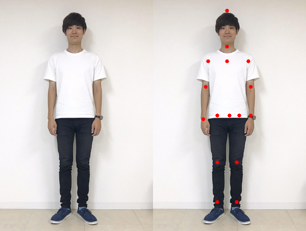
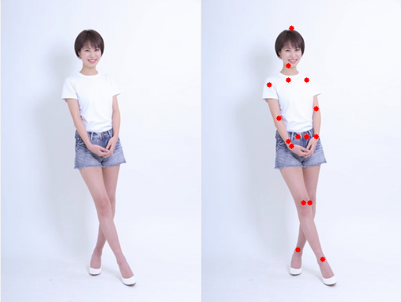
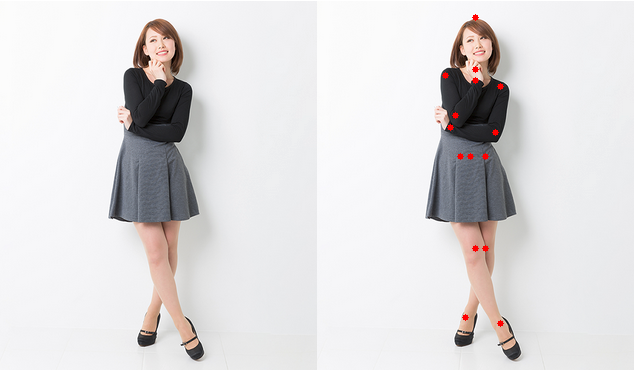
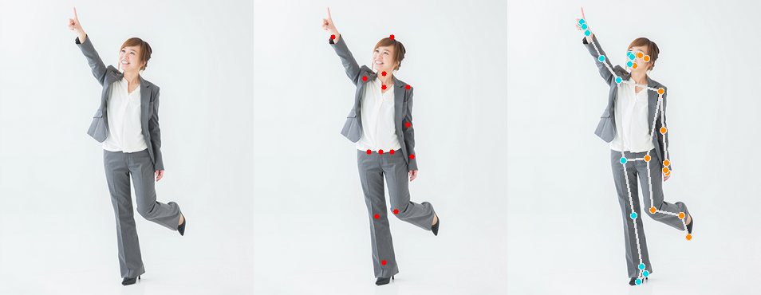
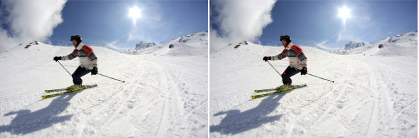

<html lang="ja">
    <head>
        <meta charset="utf-8" />
    </head>
    <body>
        <h1>
Pose Estimation
</h1>
        <h2>なにものか？</h2>
        

            画像や映像の中の人の骨格を抽出するプログラムです。 
             
             
             
             
             
             
            HRNETをチャネルプルーニング(下図の各板を薄くするイメージ)したもので 
            GPU無でも、そこそこの速度で動作します。 
             
             
             
            <table border="1">
                <tr><th>モデル</th><th>FPS (i7-7700@3.60GHz)</th></tr>
                <tr><td> model_15.onnx </td><td> 約 9.0 </td></tr>
                <tr><td> mediapipe pose </td><td> 約 7.0 </td></tr>
            </table>
             
            トップダウン方式なので、画面中央付近の一人の骨格しか抽出されません。 
            複数人、画面端付近の人の骨格を抽出したい場合は、前段に人検出器を追加して 
            切り出した画像をモデルに渡す必要があります。 
        

        <h2>環境構築方法</h2>
        <h3>model_15.onnx</h3>
        

            pip install onnx2torch opencv-python 
        

        <h3>mediapipe pose</h3>
        

            pip install mediapipe 
        

        <h2>使い方</h2>
        <h3>カメラからの映像に対して骨格抽出する場合</h3>
        

            python PoseEstimation_from_camera.py 
            python mediapipe_PoseEstimation_from_camera.py 
        

        <h3>画像に対して骨格抽出する場合</h3>
        

            python PoseEstimation_from_images.py (人が写った画像へのワイルドカード) 
            python mediapipe_PoseEstimation_from_images.py (人が写った画像へのワイルドカード) 
            例) python PoseEstimation_from_images.py *.png 
        

    </body>
